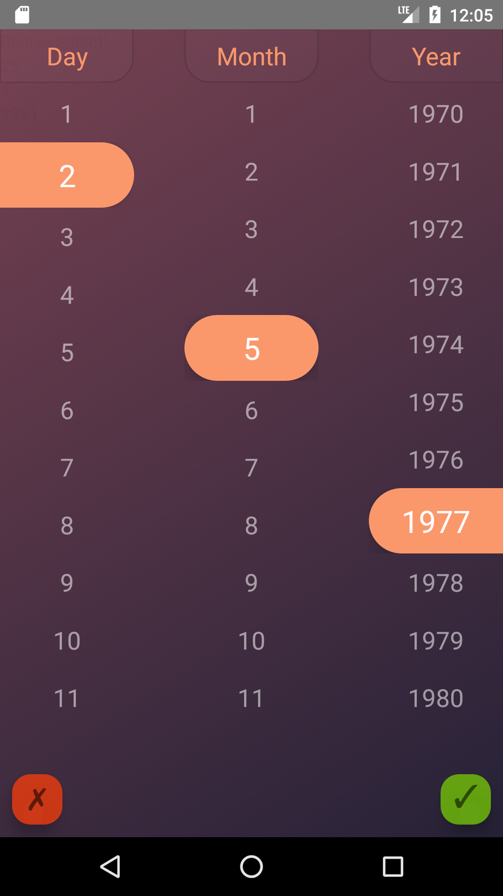

react-native-multiple-picker
===================
A fancy cross-platform multiple picker module for react-native, inspired by concept design [**Time Picker**](https://dribbble.com/shots/2630319-time-picker) in dribble. I will probably re-design the UI to have more customization for time/date picker. Currently, as I decided to build a more general multiple pickers, I changed the UI a little bit toward a general picker.




----------


Installation
-------------

**react-native-multiple-picker** uses **react-native-linear-gradient** module to handle the gradient effect. Installing  **react-native-multiple-picker** should automatically install the dependencies, however, linear gradient has to be linked. In order to install this module suiccessfuly follow the this procedure:

#### <i class="icon-file"></i> Installing react-native-linear-gradient

    npm install react-native-linear-gradient --save

Then try to link linear-gradient module by the command:

    rnpm link


> **Note:**

> if the above code was not defined try to install rnpm first:
>
>     npm install -g rnpm


after linking the project, re-build the project by the following code (based on your platform):

    react-native run-android
    react-native run-ios

 if there was any issue with this process, you may refer to the main page of the react-native-linear-gradient:

 https://github.com/react-native-community/react-native-linear-gradient


#### <i class="icon-file"></i> Installing react-native-multiple-picker

    npm install --save react-native-multiple-picker


----------


Issues
-------------------
> **Note:**

> if by any chance after installation, the the picker worked but, the gardient background did not show (in this case you only see the close and accept buttons and no background, with a probably red border around the screen), the problem is with linking. As a result, follow manual installation procedure of react-native-linear-gradient (sometimes rnpm link does not work properly):

 https://github.com/react-native-community/react-native-linear-gradient


----------

# Props
-------------------
### Main Props
#### data
data is the main props which shows the category of all the data to be shown in the picker. It should be formatted as an array of categories, in which each category is an array of items. For instance, if you want to show three categories of days, months and years (for a date picker) you can use the following style:

```
let Days =  [
              {key: 0, label: 'Sunday'},
              {key: 1, label: 'Monday'},
              {key: 2, label: 'Tuesday'},
              {key: 3, label: 'Wednesday'},
              {key: 4, label: 'Thursday'},
              {key: 5, label: 'Friday'},
              {key: 6, label: 'Saturday'},
            ]
let Months = [
              {key: 0, label: '1'},
              {key: 1, label: '2'},
              {key: 2, label: '3'},
              {key: 3, label: '4'},
              {key: 4, label: '5'},
              {key: 5, label: '6'},
              {key: 6, label: '7'},
              {key: 7,label: '8'},
              {key: 8,label: '9'},
              {key: 9,label: '10'},
              {key: 10,label: '11'},
              {key: 11,label: '12'},
           ]

        const data  = [Days, Months];
```

> **Note:**

> The **key** property should acts as index of each array. **initValue** and the value returned by the picker are selected based on the key; hence, it is suggested to start key values always from **0**, and in an ascending order.


A better way (ES6) to form numeric arrays from a starting point to an ending one (for example years between 1970 is:

```
        let firstYear = 1970;
        let years = new Array(40).fill({label: null}).map((item, id) => {
            return {label: id + firstYear, key: id}
        });

```
#### label
label is the label of each data category and should simply be entered as an array of strings, such as:

```
        let label = ['Day', 'Month', 'Year'];
```
#### onChange
this prop is the function which handles the returned value from the picker. The api of this function is:

```
onChange={(option) => {
                        console.log(option);
                        this.setState({selectedValue: option})
                    }}
```

### Additional Props

#### gradientStyle
In this version the styling of the color gradient, including different gradient colors, and their locations can be modified. **gradientStyle** should be entered as and object such as:

```

const gradStyle = {
            start: {x: 0, y: 0},
            end: {x: 1, y: 1.0},
            locations: [0, 1],
            colors: ['#743e4e', '#221d33']
        };

```

Just note that if you want to use more than two colors (for example 3) in your color gradient, the locations and colors arrays should have 3 elements, for example:


```
const gradStyle = {
            start: {x: 0, y: 0},
            end: {x: 1, y: 1.0},
            locations: [0, 0.5, 1],
            colors: ['#743e4e', '#fff', '#221d33']
        };
 ```

#### height

This parameters determines the relative hight of the picker section, and should be a number between 0 to 1. This parameter is usefull when the number of your data points are limited and a full screen picker looks ugly. For example:

``` height={0.7} ```

#### initValue
initValue can be used when you want your picker to be prefilled with some specefic data. The formatting of initValue should be an array with the length equal to the number of data categories. **Each element of this array points to index of the data which should be selected**. For example:

```initValue = [0,1,2]```


----------
Usage
-------------------

A the top of the file, in which you want to use this module, import the package:


    import Picker from 'react-native-multiple-picker';

In order to use this module, you need to define the data categories and labels in separatae arrays.
```
let Days =  [
              {key: 0, label: 'Sunday'},
              {key: 1, label: 'Monday'},
              {key: 2, label: 'Tuesday'},
              {key: 3, label: 'Wednesday'},
              {key: 4, label: 'Thursday'},
              {key: 5, label: 'Friday'},
              {key: 6, label: 'Saturday'},
            ]
let Months = [
              {key: 0, label: '1'},
              {key: 1, label: '2'},
              {key: 2, label: '3'},
              {key: 3, label: '4'},
              {key: 4, label: '5'},
              {key: 5, label: '6'},
              {key: 6, label: '7'},
              {key: 6, label: '8'},
              {key: 6, label: '9'},
              {key: 6, label: '10'},
              {key: 6, label: '11'},
              {key: 6, label: '12'},
           ]

        const data  = [Days, Months];
        const label = ['Day','Month'];


 <Picker
        data={data}
        onChange={(option) => {console.log(option)}}
        label={label}
        >
             <Text>{'Please Select!'}</Text>
 </Picker>

```


----------
Example Code
----------

```
import React, {Component} from 'react';
import {Text, View, StyleSheet} from 'react-native';
import Picker from 'react-native-multiple-picker';
class App extends Component {
    constructor() {
        super();

        this.state = {
            selectedValue: null
        }
    }

    render() {

        let firstYear = 1970;
        let years = new Array(40).fill({label: null}).map((item, id) => {
            return {label: id + firstYear, key: id}});

        let days = new Array(30).fill({label: null}).map((item, id) => {
            return {label: id + 1, key: id}});

        let months = new Array(12).fill({label: null}).map((item, id) => {
            return {label: id + 1, key: id}});


        const data  = [days, months,years];
        const label = ['Day','Month','Year'];

        const {selectedValue} = this.state;
        return (
            <View>
                <Picker
                    data={data}
                    onChange={(option) => {
                        console.log(option);
                        this.setState({selectedValue: option})
                    }}
                    label={label}


                >
                    <Text>{'Please Select!'}</Text>

                </Picker>
                <Text>{selectedValue && selectedValue.length && days[selectedValue[0]].label}</Text>
                <Text>{selectedValue && selectedValue.length && months[selectedValue[1]].label}</Text>
                <Text>{selectedValue && selectedValue.length && years[selectedValue[2]].label}</Text>
            </View>
        );
    }
}

export default App;
```


